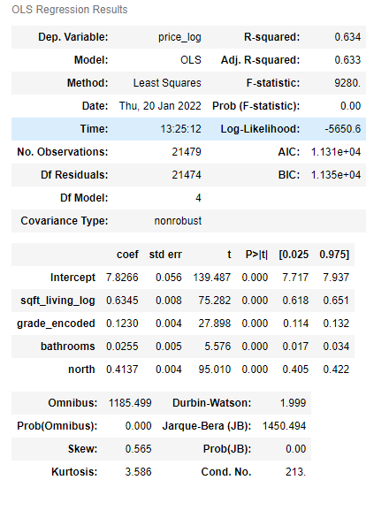

# Multiple Linear Regression with King County housing 
**Author**: [Nick Timpano](mailto:nick.timpano@gmail.com)

## Overview
In this notebook I analyze data on single family homes in King County, in order to predict the price of houses. To do so, I build an Ordinary Least Squares (OLS) multiple linear regression model to predict house prices using various features from the dataset, as well as evaluate the model and test it for linear regression assumptions.  

#### Business Problem / Audience 
Here I sought to build a model to predict house prices and unlock insights that would be useful to a local real estate developer looking to optimize for price of house with a limited budget, although any buyer/seller or party interested in the price of a house would also potentially benefit from a model such as this.  

## Data 
The data used was housing data from King County. The csv file can be viewed [here](https://github.com/ntimpano614/kc_housing_regression/blob/main/kc_house_data.csv). 

## Results
- Splitting the data into different regions resulted in finding that there was a positive relationship between northern houses and price.   

- The size of the house (`sqft_living`), number of bathrooms (`bathrooms`), quality of the construction (`grade`) and houses in the northern part of the county (`north`) were the best predictors of price without being collinear and were chosen as features for the model.  


- The model's R-Squared value indicated that 63% of the variance in price is explained by the predictors in the model.   


## Conclusions 
Based on the model and the analysis of data, these were the recommendations: 
- Build big! The size of the interior liveable space had a signficant effect on price. Size of the land/lot is less important.    
- Construction/design quality matter! Consider the quality of contractors and architects when optimizing for this. 
- Bathrooms vs. bedrooms: Focus on creating more bathrooms vs. more bedrooms when constructing and designing the layout of the house. 
- If you want to maximize price, build north of 47.5 latitude in one of these areas (

## Next Steps 
- Look at other counties and geographies to see whether the model performs well in other areas of Washington, and in the greater US. 
- Predict other outcomes, such as how quickly a house will sell given certain predictors, or the grade/quality of a house. 
- Further explore how other highly correlated variables (ie: sqft_above) could predict price 
- Explore polynomial relationships between some of the predictor variables with price 

## More Information 
To see the full EDA please see the [Jupyter Notebook](./KC_housing_regression.ipynb). 

For more information, contact [Nick Timpano](mailto:nick.timpano@gmail.com)

## Repo Structure 

```
├── pictures
├── kc_house_data.csv
├── zips_kc.csv
├── README.md
├── zip_scrape.ipynb
├── zipcode_work.ipynb
└── KC_House_Presentation.pdf
```